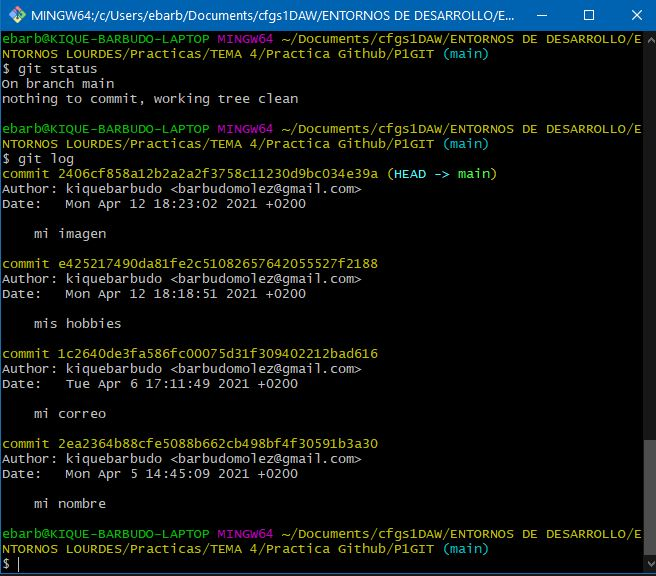
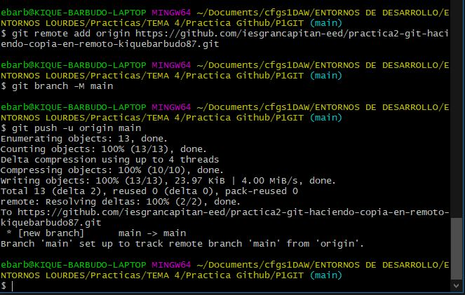

# Practica2. GIT. Haciendo una copia en remoto
Siguiendo con la práctica anterior, vas a realizar una copia del repositorio local en GitHub. Para ello envía un pantallazo de cada apartado:
1. Estudia el estado del repositorio local: Todos los commits (hasta "mi imagen") y con tu directorio de trabajo limpio (sin ningún cambio por añadir al repositorio). Confirma que no estás en modo detached HEAD (el último commit debe reflejar HEAD -> master)  

2. Acepta esta tarea de GitHub. Crearás un repositorio remoto VACÍO. No tiene ni README
3. Fíjate en las sujerencias de GitHub. Como partes de un repositorio local ya creado, sigue las siguientes instrucciones que te sugiere GitHub... PERO RECUERDA que tu rama NO TIENE POR QUÉ ser la indicada  

…or push an existing repository from the command line  

git remote add origin https://github.com/iesgrancapitan-eed/practica2-git-haciendo-copia-en-remoto-lmagarin.git  

git branch -M main  

git push -u origin main  

4. En local (no debes trabajar en el remoto) y siempre desde git Bash añade el fichero README.md con estas instrucciones y sus pantallazos.
5. Sincroniza tus cambios con el repositorio remoto (git push)

Sigue paso a paso, responde y adjunta pantallazos en este README.md
- Crea un directorio/carpeta vacía con el nombre de esta práctica.
  - Abre git bash en un directorio/carpeta vacía (menú contextual)  
  

  - Ejecuta **git** sin argumentos. Mostrará los comandos básicos. Indica los distintos apartados  
    
  
